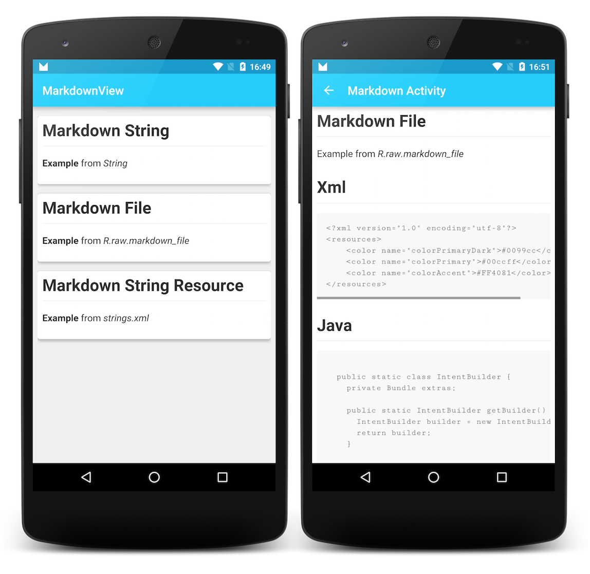

# MarkdownView
[](https://jitpack.io/#fiskurgit/MarkdownView) [](https://travis-ci.org/fiskurgit/MarkdownView) [](https://github.com/fiskurgit/ChipCloud/blob/master/LICENSE) [](https://gitter.im/fiskurgit/fiskur) 

Markdown view for Android. Display [Markdown](https://en.wikipedia.org/wiki/Markdown) in your apps, useful for FAQs, Help, Size Guides, About screens etc. To make things really easy there's an Activity included, just use the included IntentBuilder.

This library is essentially just a wrapper around [Marked.js](https://github.com/chjj/marked) and uses [Github Markdown CSS](https://github.com/sindresorhus/github-markdown-css) to style the generated Markdown.



## Usage

### Activity
Launch the activity using the builder and supply one of three sources for the Markdown content: ```markdown(String)```, ```stringResourceId(R.string.markdown_string)```, or a .md file in the res/raw directory: ```rawFileId(R.raw.markdown_file)```.

```java
Intent intent = MarkdownActivity.IntentBuilder.getBuilder()
    .showToolbar(true)
    .title("Markdown")
    .displayHomeAsUp(true)
    .markdown("# Hello Markdown\n\n[fiskurgit](https://github.com/fiskurgit)")
    .allowGestures(false)
    .build(MainActivity.this);

startActivity(intent);
```
### View

The cleanest way to display markdown is to add the 'markdown' namespace to your parent layout: ```xmlns:markdown="http://schemas.android.com/apk/res-auto"``` and then use the ```markdown:rawFile``` and ```markdown:markdown``` xml attributes in your MarkdownView declaration:

```xml
<eu.fiskur.markdownview.MarkdownView
    markdown:rawFile="@raw/markdown_file"
    android:layout_width="match_parent"
    android:layout_height="115dp" />
    
<eu.fiskur.markdownview.MarkdownView
    markdown:markdown="@string/markdown_string_resource"
    android:layout_width="match_parent"
    android:layout_height="115dp" />
```

or do it in code from a Fragment or Activity:

```java
MarkdownView markdownView = (MarkdownView) findViewById(R.id.markdown_view);

//load a md file from the raw directory:
markdownView.showMarkdown(R.raw.markdown_file);

//or use a String
markdownView.showMarkdown("# Hello Markdown\n\n[fiskurgit](https://github.com/fiskurgit)");
```

##Dependency

Add jitpack.io to your root build.gradle, eg:

```groovy
allprojects {
    repositories {
        jcenter()
        maven { url "https://jitpack.io" }
    }
}
```

then add the dependency to your project build.gradle:

```groovy
dependencies {
    compile fileTree(dir: 'libs', include: ['*.jar'])
    compile 'com.github.fiskurgit:MarkdownView:1.0.1'
}
```
You can find the latest version in the releases tab above: https://github.com/fiskurgit/MarkdownView/releases

More options at jitpack.io: https://jitpack.io/#fiskurgit/MarkdownView

##Licence

Full licence here: https://github.com/fiskurgit/MarkdownView/blob/master/LICENSE

In short:

> The MIT License is a permissive license that is short and to the point. It lets people do anything they want with your code as long as they provide attribution back to you and don’t hold you liable.
